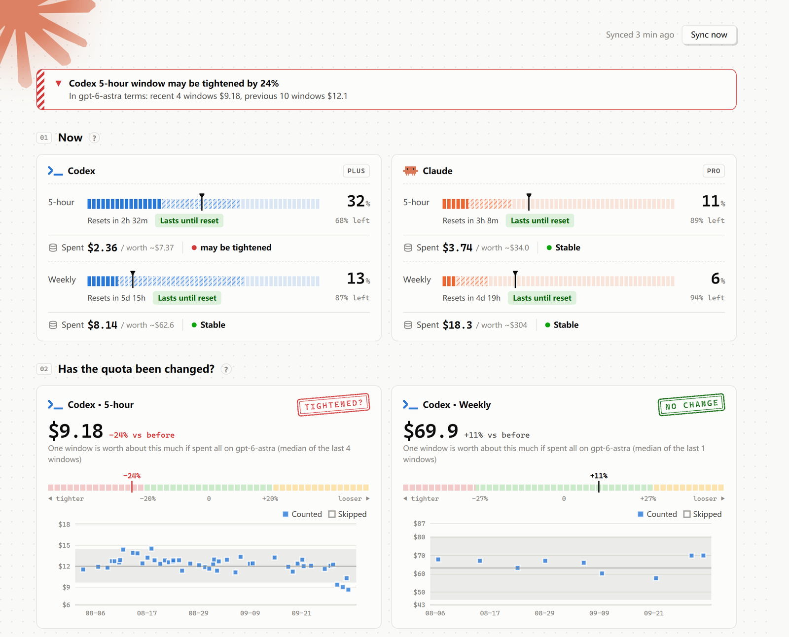
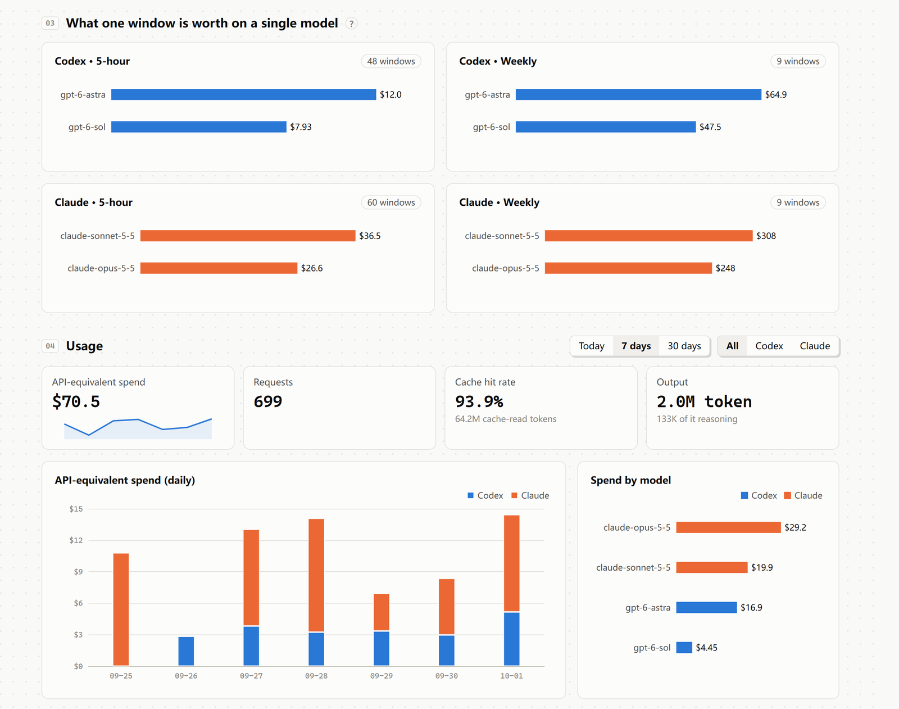

<div align="center">


# How much my Claude

**What is one quota window of your Claude / Codex subscription actually worth — and did it just get smaller?**

Turns your Codex CLI and Claude Code subscription usage into API-equivalent dollars,<br>works out what each 5-hour and weekly window is worth, and watches for silent quota changes.

[](https://github.com/Deco025/quota-lens/actions/workflows/test.yml)


[](LICENSE)

[中文](README.md) · [Install](#install) · [How changes are detected](#how-changes-are-detected) · [Privacy](#privacy-and-security)

</div>

<picture>
  <source media="(prefers-color-scheme: dark)" srcset="docs/images/hero-en-dark.png">
  
</picture>

<p align="center"><sub>The screenshot uses made-up demo data: Codex's 5-hour quota was quietly tightened 3 days ago, and the tool caught it. Try it: <code>how-much-my-claude-server --demo --open</code></sub></p>

## What it tells you

- **What a window is worth**: how many dollars of API usage each 5-hour and weekly window holds, down to each model — the same $1 can use up very different amounts of quota on different models.
- **Whether the quota changed**: every window is measured with the same ruler; when recent windows fall outside normal noise you get a banner and a system notification. A rubber stamp and a deviation gauge make the verdict obvious.
- **Whether it will last**: a pixel progress bar shows what you've used, where you'll be at reset at the current pace, and how much of the window's time has passed; running out early turns it red.
- **Not fooled by noise**: usage your local logs can't see (other devices, web chat) is detected and removed; coming back after a break compares across the gap; switching main models is reported honestly as "can't compare yet".
- **Fully local**: it only reads local logs — no separate sign-in, no uploads, no telemetry. Data is kept forever, and you decide what to keep or delete.

<picture>
  <source media="(prefers-color-scheme: dark)" srcset="docs/images/more-en-dark.png">
  
</picture>

> Not affiliated with Anthropic or OpenAI. The quota endpoints are unofficial ones the official CLIs use themselves; they may change or stop working at any time.

## Try the demo

No account needed — run it on made-up data first:

```bash
how-much-my-claude-server --demo --open
```

Demo data lives in a temporary folder; it doesn't read your logs, check any quota or touch the network. From source: `python run.py --demo --open`.

## Install

Requires Python 3.10 or newer.

**With pipx (recommended):**

```bash
pipx install git+https://github.com/Deco025/quota-lens.git
```

```bash
how-much-my-claude-install
```

The second command creates a launcher: on the Desktop on Windows, in `~/Applications` on macOS, in the app menu on Linux. Open "How much my Claude" from there, or run `how-much-my-claude`.

**From source:**

```bash
git clone https://github.com/Deco025/quota-lens.git
```

```bash
cd quota-lens && pip install -r requirements.txt
```

```bash
python install.py
```

Per-system notes:
- **Windows**: the window uses the built-in Edge WebView2; nothing else to install.
- **macOS**: the first Claude quota check asks whether to allow reading "Claude Code-credentials" from the Keychain; choose "Always Allow".
- **Linux**: the window needs a GTK or Qt backend — see [pywebview's install guide](https://pywebview.flowrl.com/guide/installation.html) (e.g. `pip install "pywebview[qt]"`). The tray needs desktop-environment support. If the window won't work, use the browser version.

## Connecting your accounts

**You don't sign in to this tool.** It reads what Codex CLI and Claude Code already keep:

| | Usage (tokens) | Quota % | Login |
|---|---|---|---|
| Codex | `~/.codex/sessions/**/rollout-*.jsonl` | included in the logs; while idle also `chatgpt.com/backend-api/wham/usage` | `~/.codex/auth.json` |
| Claude Code | `~/.claude/projects/**/*.jsonl` | polls `api.anthropic.com/api/oauth/usage` (the endpoint behind Claude Code's `/usage`) | Windows / Linux: `~/.claude/.credentials.json`; macOS: Keychain |

So just install them, sign in, and use them once. If something is missing, the top of the page says exactly what to do (e.g. "Can't find Claude Code's login — run claude and sign in once"). "Status" at the bottom shows both connections. `CODEX_HOME` and `CLAUDE_CONFIG_DIR` are respected.

## Using it

- **Closing the window only hides it to the tray**; collection continues. Click the tray icon to open it; the menu has Sync now, Start at login and Quit. On macOS there is no tray and closing the window quits.
- Opening it again while it runs brings the existing window to the front.
- **Start at login**: tick it in the tray menu or run `how-much-my-claude-install --startup`. It then runs in the background without a window. Claude quota percentages can only be collected while it runs, so this is recommended.
- Quit: tray menu "Quit", or "Stop service" under Status at the bottom of the page.
- Remove launchers: `how-much-my-claude-install --remove`.
- Browser only: `how-much-my-claude-server --open` (`python run.py --open` from source), then open http://127.0.0.1:8787.

The first launch imports the last 90 days of logs (a few GB take about 10 s), then scans incrementally every 60 s. Older logs can be imported with one click under Data.

**Settings** (bottom of the page): language, system notifications, how often to check Claude quota while idle, the minimum change that counts as "adjusted", the "new model" threshold, and how many days to import on first launch.

## Privacy and security

- The server listens on 127.0.0.1 only and rejects requests from other websites (Host and Origin checks).
- It only talks to `api.anthropic.com` and `chatgpt.com` (quota, using the login token already on your machine) and `models.dev` (the public price list). No telemetry, nothing else.
- Login tokens are read-only and never refreshed (refreshing would sign the CLI out), and are never written to logs or the database. Archived API responses have e-mail and account IDs removed.
- The chart library is bundled; the page loads nothing from the internet.

## Where data lives

| System | Folder |
|---|---|
| Windows | `%LOCALAPPDATA%\how-much-my-claude` |
| macOS | `~/Library/Application Support/how-much-my-claude` |
| Linux | `~/.local/share/how-much-my-claude` |

Set `QUOTALENS_DATA_DIR` to put it elsewhere. It holds the database `quotalens.db`, daily `backups/`, the log `quota-lens.log` and your `prices_override.json`. Data from older versions (in the source folder's `data/`) is copied over on first launch; the old copy is left untouched.

- The database is **kept forever** and never cleaned up automatically; it's backed up daily (last 14 kept).
- Under **Data** at the bottom of the page you can:
  - choose **Analyze / Keep only** per subscription plan — "Keep only" leaves the data untouched but out of rates, trends and alerts (good for an old account);
  - **delete** all windows of a plan — the whole database is backed up first to `backups/before-delete-*.db`; deleted data won't come back when logs are re-read, and new data is recorded if you use that plan again;
  - **import all past logs**.
- Single windows can be **excluded** from Window history or the window details (e.g. you also used another device in that window), and restored anytime.

## How changes are detected

Every verdict, number and model name on the page is computed from your own data each time; the page only fills them into sentences.

1. **API-equivalent spend**: fresh input × input price + cache reads × cache-read price + cache writes × cache-write price + output × output price, with prices from [models.dev](https://models.dev) (refreshed daily, including long-context tiers and fast mode). Claude 1-hour cache writes count at 2× input, 5-minute ones at 1.25×. Codex `input_tokens` include cached tokens, which are subtracted first. All history is re-priced with the same table, so price updates don't create fake jumps.
2. **Assigning usage to windows**: Codex logs record the window (`resets_at`) each request used, so attribution is exact even across account switches. Claude logs don't, so usage is assigned by time — this assumes one Claude account and no API key running `claude-*` models.
3. **External usage**: usage outside local logs (other devices, cloud tasks, claude.ai chat) raises the percentage with no local spend. Steps that jump ≥3% and more than 3× the expected rise plus 2 points, or rise ≥2% with no local spend at all, count as external and are subtracted. Windows with ≥15% external usage are left out.
4. **Model rates**: quota use isn't proportional to API price, so per-model rates are fitted with non-negative least squares over clean windows of the last 60 days: used% ≈ Σ rate[model] × spend[model].
5. **Trend and alerts**: each window is converted to "what it's worth if spent entirely on the main model". 5-hour windows: last 72 hours vs the 3 weeks before (≥3 and ≥5 windows). Weekly windows: latest vs the previous 2–4. The median ratio is compared with a threshold = max(the minimum change in Settings, default 20%; 2.5 × baseline spread × sample-size factor), so noisy data widens it automatically. Crossing it shows a banner and a system notification (once per direction per 24 h).
   - **Across a break**: when you stop for a while and come back, there are no recent windows to compare with, so the last windows before the break become the baseline and the card says so. Otherwise a change made during the break would silently become the new normal. The chart folds the break into a short gap.
6. **New model**: detected automatically from model names in the logs. If less than half of recent spend (configurable) comes from models also used in the baseline (≥10% share there), the two periods can't be compared — the rate fit would absorb a quota change as "the new model is just more expensive". The stamp then says NEW MODEL, no verdict and no alert, only a rough API-dollar comparison. After a few weeks the new model is compared with itself.
7. **Rule changes**: new or vanished API / log fields, plan changes, new limit windows and early resets are found from the data as context for jumps in the trend.

## Custom prices

"Model prices" at the bottom lists the price found for every model you've used (or the whole table), in USD per million tokens. For a model without a price, create `prices_override.json` in the data folder (see `prices_override.example.json`), or use `{"same_as": "other-model"}`. Click "Sync now" to apply.

## Known limitations

- Usage that local logs can't see can only be detected and subtracted, not reconstructed; polluted windows are left out.
- Claude logs don't record the account or key: switching Claude accounts, or running `claude-*` models with an Anthropic API key, mixes into the current account's windows.
- Requests routed to third-party models through tools like CC Switch (deepseek, glm, …) are recognized and not counted or priced.
- Percentages are integers, so estimates are wide early in a window.
- The quota endpoints are unofficial and may change; field changes show up under Rule changes.
- The window, tray and launchers on macOS and Linux haven't been tested much on real machines yet — issues welcome.

## Development

```bash
pip install -r requirements.txt httpx
```

```bash
python -m unittest discover tests
```

After adding Chinese UI text, run `python tools/i18n_keys.py` to list entries still missing from `quotalens/web/i18n.js`. The app icon is drawn in code: `python tools/make_icon.py`.

## License

[MIT](LICENSE). Third-party material: [THIRD_PARTY.md](THIRD_PARTY.md).
